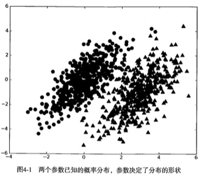
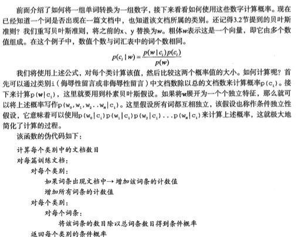
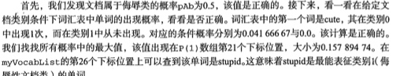
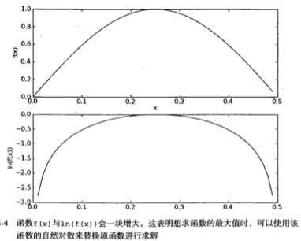

#贝叶斯算法
给出最优类别猜测结果,同时给出这个猜测的概率估计值
使用概率论的分类方法进行,给出一些假设来学习贝叶斯分类器,称之为朴素
优点:在数据很小的情况依然有效
缺点:对于输入的数据的准备方式较为敏感
适用数据:标称型数据
贝叶斯理论的核心:选择高概率对应的类别.也就是选择具有最高概率的决策.

##贝叶斯算法理论



* 如果p1(x,y) > p2(x,y) 那么类别为1
* 如果p2(x,y) > p1(x,y) 那么类别为2
* 也就是说会选择高概率


目前有三种方式处理这个数据:
1.适用KNN,进行1000次距离计算
2.适用决策树,分别沿X轴,Y轴划分数据
3.计算数据点属于每个类别的概率,并进行比较

###贝叶斯文档分类:
每个词的出现和不出现作为一个分类.常用的是朴素贝叶斯分类.

####一般过程
1.收集数据:RSS源 
2.准备数据:需要数值型,布尔型
3.分析数据,有大量特征时候,建议直方图
4.训练算法:计算不同的独立特征的条件概率
5.测试算法:计算错误率
6.使用算法:一个常见的朴素贝叶斯应用是文档分类,可以在任意分类场景中使用朴素贝叶斯分类,	
####a.Python进行文本分类
词表到向量的转换函数:也就是说将句子转换为向量

```
#postingList:创建实验样本,将词条切分之后的文档集合
#classVec:类别标签集合,这里有两类,分别由人工进行标注
def loadDataSet():
    postingList=[['my', 'dog', 'has', 'flea', 'problems', 'help', 'please'],
                 ['maybe', 'not', 'take', 'him', 'to', 'dog', 'park', 'stupid'],
                 ['my', 'dalmation', 'is', 'so', 'cute', 'I', 'love', 'him'],
                 ['stop', 'posting', 'stupid', 'worthless', 'garbage'],
                 ['mr', 'licks', 'ate', 'my', 'steak', 'how', 'to', 'stop', 'him'],
                 ['quit', 'buying', 'worthless', 'dog', 'food', 'stupid']]
    classVec = [0,1,0,1,0,1]    #1 is abusive, 0 not
    return postingList,classVec
```

```
#获取不重复的单词列表
#将文档添加的新词返回到集合当中,操作符|用于求两个集合的并集
def createVocabList(dataSet):
    vocabSet = set([])  #create empty set
    for document in dataSet:
        vocabSet = vocabSet | set(document) #union of the two sets
    return list(vocabSet)
```

```
#根据获取的词汇获取文档向量
def setOfWords2Vec(vocabList, inputSet):
    returnVec = [0]*len(vocabList)
    for word in inputSet:
        if word in vocabList:
            returnVec[vocabList.index(word)] = 1
        else: print "the word: %s is not in my Vocabulary!" % word
    return returnVec
```

```
#判断一个输入的单词inputSet,在不重复的词汇向量中是否存在
#返回1,0 这种向量数组
def setOfWords2Vec(vocabList, inputSet):
    returnVec = [0]*len(vocabList)
    for word in inputSet:
        if word in vocabList:
            returnVec[vocabList.index(word)] = 1
        else: print "the word: %s is not in my Vocabulary!" % word
    return returnVec
```

一个简单的调用过程

```
#listOPosts: 输入文章词汇样本
postingList=[['my', 'dog', 'has', 'flea', 'problems', 'help', 'please'],
                 ['maybe', 'not', 'take', 'him', 'to', 'dog', 'park', 'stupid'],
                 ['my', 'dalmation', 'is', 'so', 'cute', 'I', 'love', 'him'],
                 ['stop', 'posting', 'stupid', 'worthless', 'garbage'],
                 ['mr', 'licks', 'ate', 'my', 'steak', 'how', 'to', 'stop', 'him'],
                 ['quit', 'buying', 'worthless', 'dog', 'food', 'stupid']]
#listClasses: 输入特征分类 这是按照之前的样本纵向得出的
0
1
0
1
0
1
classVec = [0,1,0,1,0,1]
#myVocablist：去重词汇   方法:bayes.createVocabList
['cute', 'love', 'help', 'garbage', 'quit', 'I', 'problems', 'is', 'park', 'stop', 'flea', 
'dalmation', 'licks', 'food', 'not', 'him', 'buying', 'posting', 'has', 'worthless',
 'ate', 'to', 'maybe', 'please', 'dog', 'how', 'stupid', 'so', 'take', 'mr', 'steak', 'my']
# 输出是否词汇的列表  方法:bayes.setOfWords2Vec
[0, 0, 1, 0, 0, 0, 1, 0, 0, 0, 1, 0, 0, 0, 0, 0, 0, 0, 1, 0, 0, 0, 0, 1, 1, 0, 0, 0, 0, 0, 0, 1]

listOPosts,listClasses = bayes.loadDataSet()
myVocablist = bayes.createVocabList(listOPosts)
print myVocablist
print bayes.setOfWords2Vec(myVocablist,listOPosts[0])
print bayes.setOfWords2Vec(myVocablist,listOPosts[3])
```

####b.训练算法:从词向量计算概率


简单的函数代码实现

```
def trainNB0(trainMatrix,trainCategory):
    numTrainDocs = len(trainMatrix)
    numWords = len(trainMatrix[0])
    pAbusive = sum(trainCategory)/float(numTrainDocs)
    p0Num = ones(numWords); p1Num = ones(numWords)      #change to ones() 
    p0Denom = 2.0; p1Denom = 2.0                        #change to 2.0
    for i in range(numTrainDocs):
        if trainCategory[i] == 1:
            p1Num += trainMatrix[i]
            p1Denom += sum(trainMatrix[i])
        else:
            p0Num += trainMatrix[i]
            p0Denom += sum(trainMatrix[i])
    p1Vect = log(p1Num/p1Denom)          #change to log()
    p0Vect = log(p0Num/p0Denom)          #change to log()
    return p0Vect,p1Vect,pAbusive
```

```
#调用过程:
#input: 构建trainMatrix这个训练集合.
#构建计算概率矩阵#
trainMat = []
for postinDoc in listOPosts:
    trainMat.append(bayes.setOfWords2Vec(myVocablist,postinDoc))
#调用计算概率
p0V,p1V,pAb = bayes.trainNB0(trainMat,listClasses)
```




####c.测试算法：根据实际情况修改分类器
* 为了避免如果其中的一个概率值为0，那么最终的结果也变成了0，需要消除这个影响，那么需要将出现的次数初始化为1，并将分母初始化为2
* 计算乘积的时候,由于大部分因子都非常小,所以想乘以的时候都得不出答案,解决方法就是:对乘积取自然对数

这样对输出的结果去Log并不会影响曲线的求极值


```
#贝叶斯分类函数
def classifyNB(vec2Classify, p0Vec, p1Vec, pClass1):
    p1 = sum(vec2Classify * p1Vec) + log(pClass1)    #element-wise mult
    p0 = sum(vec2Classify * p0Vec) + log(1.0 - pClass1)
    if p1 > p0:
        return 1
    else: 
        return 0
```

贝叶斯测试算法:

```
#测试算法分类器 基于前面已经计算了p0v,p1v,pab#
testEntry = ['love', 'my', 'dalmation']
#计算需要测试分类的概率矩阵向量
thisDoc = array(bayes.setOfWords2Vec(myVocablist, testEntry))
#利用原先样本集的计算制表
print testEntry,'classified as: ',bayes.classifyNB(thisDoc,p0V,p1V,pAb)
```

准备数据:文档词袋模型

目前为止:我们将每个词的是否出现作为一个特征,这个是词集模型
如果一个词在文档里面不止出现一次,那么称为词袋模型

```
#需要在碰到每个词的时候不光设置词的内容为1,而是自动进行+1
#如果需要调用词袋模型，则只需要更改 setOfWords2Vec =》 bagOfWords2VecMN
def bagOfWords2VecMN(vocabList, inputSet):
    returnVec = [0]*len(vocabList)
    for word in inputSet:
        if word in vocabList:
            returnVec[vocabList.index(word)] += 1
    return returnVec
```


###一个经典的案例:朴素贝叶斯过滤垃圾邮件
从文本内容得到字符串列表,生成词向量,通过通用框架来处理解决

1. 收集数据:提供文本文件
2. 准备数据:将文本解析成词向量
3. 分析数据:检查词条确保解析的正确性
4. 训练算法，利用我们之前建立的trainNBO()函数
5. 测试算法，利用classfiNB(),构建测试函数测试数据的准确性
6. 使用算法，对数据进行分类，并将数据输出到屏幕上


####a.解析文本:

```
def textParse(bigString):    #input is big string, #output is word list
    import re
    listOfTokens = re.split(r'\W*', bigString)
    return [tok.lower() for tok in listOfTokens if len(tok) > 2] 
```

####b.贝叶斯分类

1. 导入文件夹spam/ham下面所有的文件邮件
2. 随机选择其中的10封文件,将这些文档当做测试数据集,这里会存在留存交叉验证,进行多次迭代,随机选择不同的文件,这样可以计算平均错误率.
3. 采用for循环遍历所有的数据集,采用setofwords2verc构建词向量,计算分类概率,如果分类错误,则错误数+1,最后统计最终的错误率.
4. 执行多次,计算错误率的平均值

```
def spamTest():
    docList=[]; classList = []; fullText =[]
#1.解析文件里面解析读取数据:
    for i in range(1,26):
        wordList = textParse(open('email/spam/%d.txt' % i).read())
        #这里是扩展二维数组
        docList.append(wordList)
        #这里是横向扩展数组
        fullText.extend(wordList)
        classList.append(1)
        wordList = textParse(open('email/ham/%d.txt' % i).read())
        docList.append(wordList)
        fullText.extend(wordList)
        classList.append(0)
    vocabList = createVocabList(docList)#create vocabulary
    #创建测试数据集合数据 [29, 36, 46, 19, 33, 38, 25, 10, 13, 42]
    trainingSet = range(50); testSet=[]           #create test set
    for i in range(10):
        randIndex = int(random.uniform(0,len(trainingSet)))
        testSet.append(trainingSet[randIndex])
        del(trainingSet[randIndex])  
    #开始数据集的统计
    trainMat=[]; trainClasses = []
    for docIndex in trainingSet:#train the classifier (get probs) trainNB0
        trainMat.append(bagOfWords2VecMN(vocabList, docList[docIndex]))
        trainClasses.append(classList[docIndex])
    #使用样本数据集跑脚本
    p0V,p1V,pSpam = trainNB0(array(trainMat),array(trainClasses))
    errorCount = 0
    #使用测试数据集合校对#
    for docIndex in testSet:        #classify the remaining items
        wordVector = bagOfWords2VecMN(vocabList, docList[docIndex])
        if classifyNB(array(wordVector),p0V,p1V,pSpam) != classList[docIndex]:
            errorCount += 1
            print "classification error",docList[docIndex]
    print 'the error rate is: ',float(errorCount)/len(testSet)
    #return vocabList,fullText
```

###一个经典的案例:贝叶斯分类器从个人广告中获取区域倾向
从两个城市选取一些人,通过分析这些人发布的征婚广告,比较人们在广告用词上是否不同,他们各自常用的词有哪些,对于不同城市的人关心的内容有什么不同?

1. 收集数据:提供文本文件
2. 准备数据:将文本解析成词向量
3. 分析数据:检查词条确保解析的正确性
4. 训练算法，利用我们之前建立的trainNBO()函数
5. 测试算法，利用classfiNB(),构建测试函数测试数据的准确性
6. 使用算法，对数据进行分类，并将数据输出到屏幕上


遍历词汇表中的每个词统计它在文本中出现的次数,然后从高到低进行排序,返回排序最高的100单词

```
def calcMostFreq(vocabList,fullText):
    import operator
    freqDict = {}
    for token in vocabList:
        freqDict[token]=fullText.count(token)
    sortedFreq = sorted(freqDict.iteritems(), key=operator.itemgetter(1), reverse=True) 
    return sortedFreq[:30]   
```

获取到A城市的发表评论,获取到B城市的发表评论,建立贝叶斯分类规则,抽取样本数据分析里面的内容是属于A城市的,还是B城市的.
这里的差异点是:将排名前100的高频词去除,排除在数据之外.

```
def localWords(feed1,feed0):
    import feedparser
    docList=[]; classList = []; fullText =[]
    minLen = min(len(feed1['entries']),len(feed0['entries']))
    for i in range(minLen):
        wordList = textParse(feed1['entries'][i]['summary'])
        docList.append(wordList)
        fullText.extend(wordList)
        classList.append(1) #NY is class 1
        wordList = textParse(feed0['entries'][i]['summary'])
        docList.append(wordList)
        fullText.extend(wordList)
        classList.append(0)
    vocabList = createVocabList(docList)#create vocabulary
    top30Words = calcMostFreq(vocabList,fullText)   #remove top 30 words
    for pairW in top30Words:
        if pairW[0] in vocabList: vocabList.remove(pairW[0])
    trainingSet = range(2*minLen); testSet=[]           #create test set
    for i in range(20):
        randIndex = int(random.uniform(0,len(trainingSet)))
        testSet.append(trainingSet[randIndex])
        del(trainingSet[randIndex])  
    trainMat=[]; trainClasses = []
    for docIndex in trainingSet:#train the classifier (get probs) trainNB0
        trainMat.append(bagOfWords2VecMN(vocabList, docList[docIndex]))
        trainClasses.append(classList[docIndex])
    p0V,p1V,pSpam = trainNB0(array(trainMat),array(trainClasses))
    errorCount = 0
    for docIndex in testSet:        #classify the remaining items
        wordVector = bagOfWords2VecMN(vocabList, docList[docIndex])
        if classifyNB(array(wordVector),p0V,p1V,pSpam) != classList[docIndex]:
            errorCount += 1
    print 'the error rate is: ',float(errorCount)/len(testSet)
    return vocabList,p0V,p1V
```

对在不同单词里面的使用概率进行逆向排序得出单词的使用频次
```
def getTopWords(ny,sf):
    import operator
    vocabList,p0V,p1V=localWords(ny,sf)
    topNY=[]; topSF=[]
    for i in range(len(p0V)):
        if p0V[i] > -6.0 : topSF.append((vocabList[i],p0V[i]))
        if p1V[i] > -6.0 : topNY.append((vocabList[i],p1V[i]))
    sortedSF = sorted(topSF, key=lambda pair: pair[1], reverse=True)
    print "SF**SF**SF**SF**SF**SF**SF**SF**SF**SF**SF**SF**SF**SF**SF**SF**"
    for item in sortedSF:
        print item[0]
    sortedNY = sorted(topNY, key=lambda pair: pair[1], reverse=True)
    print "NY**NY**NY**NY**NY**NY**NY**NY**NY**NY**NY**NY**NY**NY**NY**NY**"
    for item in sortedNY:
        print item[0]
```


