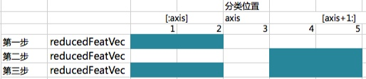
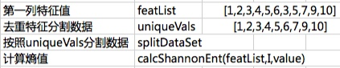
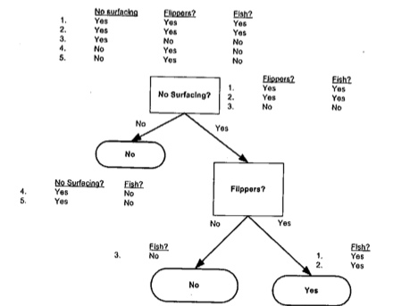
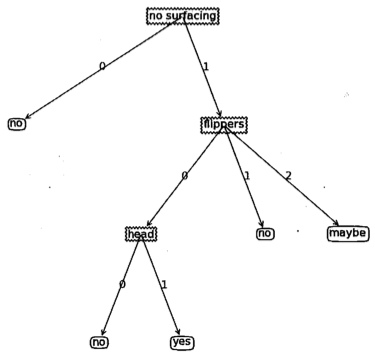

#决策树算法
决策树的数据格式很好理解，通过对一个人提问20个问题，那么最终得到结果，正方形代表判断模块，椭圆代表终止模块，左右箭头均表示分支。
1.优点：计算复杂度不高，输出结果易于理解，可以处理不相关特征数据
2.缺点：可能会产生过度匹配问题
3.适用数据类型：数值型和标称型

##决策树算法的一般流程

###一：决策树算法过程
收集数据：使用任意方法
准备数据：只适用标称型，如果数值必须离散化
分析数据：可以使用任何方法，构造树完成之后
训练算法：构造树的数据结构
测试算法：使用经验树计算错误率
使用算法：用于任何监督学习算法，可以更好地理解数据的内在含义

一些决策树使用二分算法，

###二:信息增益熵值

###计算熵值
1. 显示保存实例总数，创建一个数据字典，对于不同的分类去统计这个分类出现的次数。
2. 对于所有类的标签发生频率计算类别出现的概率，并计算熵值

```
def calcShannonEnt(dataSet):  
    numEntries = len(dataSet)  
    labelCounts = {}  
    for featVec in dataSet: #the the number of unique elements and their occurance  
        currentLabel = featVec[-1]  
        if currentLabel not in labelCounts.keys(): labelCounts[currentLabel] = 0  
        labelCounts[currentLabel] += 1  #收集所有类别的数目，创建字典  
    shannonEnt = 0.0  
    for key in labelCounts:  
        prob = float(labelCounts[key])/numEntries  
        shannonEnt -= prob * log(prob,2) #log base 2  计算熵  
    return shannonEnt  
```

####调优熵值
调试熵的整体步骤：
熵越高，则混合数据越多，可以添加更多的分类，观察熵是如何变化。

```
myDat,labels = trees.createDataSet()
print myDat
print trees.calcShannonEnt(myDat) #计算熵值
dataSet = [[1, 1, 'maybe'],[1, 1, 'yes'],[1, 1, 'yes'],[1, 0, 'no'],[0, 1, 'no'],[0, 1, 'no']]
print trees.calcShannonEnt(dataSet) #添加分类标签
```

###三:划分数据集
#####1.依据:
数据集合划分通过某一类型等于某一个值的数据

a. 创建新的list对象 
b. 数据抽取
c. 返回的数据集合去除中间本身元素



#####2.数据集划分代码

```
#dataSet 划分数据集合[[1, 1, 'maybe'],[1, 1, 'yes'],[1, 1, 'yes'],[1, 0, 'no'],[0, 1, 'no'],[0, 1, 'no']]
#axis 数据筛选的列 0:代表对于第一个元素
#value 筛选的值 等于什么
def splitDataSet(dataSet, axis, value):
    retDataSet = []
    for featVec in dataSet:
        if featVec[axis] == value:
            reducedFeatVec = featVec[:axis]     #chop out axis used for splitting
            reducedFeatVec.extend(featVec[axis+1:])
            retDataSet.append(reducedFeatVec)
    return retDataSet
```

实例测试

```
dataSet = [[1, 1, 'maybe'],[1, 1, 'yes'],[1, 1, 'yes'],[1, 0, 'no'],[0, 1, 'no'],[0, 1, 'no']]
print trees.splitDataSet(dataSet,0,0)
```

#####3.遍历整个数据集，循环计算香农熵和splitDataSet函数，找到最好的特征划分方式
a. 数据必须是由列表元素组成的列表，而且所有列表必须要有相同的长度
b. 数据的最后一列或者每个实例的最后一个元素是当前实例的标签

#####寻找最优的数据集分类并计算信息熵的最大值

算法核心步骤：

a. 创建唯一的分类标签列表
b. 计算每种划分方式的信息熵
c. 计算最好的信息增益:
    1. 通过对每一个特征位置按照特征值进行分割获取明细数据集
    2. 计算每个数据集特征值的总和,
    3. 通过这个可以去对比不同特征之间的差异,找出最大特征熵
d. 最终我们可以通过得到的特征值分类去评判本身分类的意义和效果

算法说明


```
def chooseBestFeatureToSplit(dataSet):
    numFeatures = len(dataSet[0]) - 1      #获取到特征值个数 最后一个默认是标签 the last column is used for the labels
    baseEntropy = calcShannonEnt(dataSet)  #计算最原始的熵指
    bestInfoGain = 0.0; bestFeature = -1
    for i in range(numFeatures):        #循环遍历特征数 iterate over all the features
        featList = [example[i] for example in dataSet]#获取到第一列的所有特征数 create a list of all the examples of this feature
        uniqueVals = set(featList)       #将特征值放置到Set里面 主要是去除重复特征值 get a set of unique values
        newEntropy = 0.0
        for value in uniqueVals:
            subDataSet = splitDataSet(dataSet, i, value)
            prob = len(subDataSet)/float(len(dataSet))
            newEntropy += prob * calcShannonEnt(subDataSet)     
        infoGain = baseEntropy - newEntropy     #返回分割数据集的特征值 calculate the info gain; ie reduction in entropy
        if (infoGain > bestInfoGain):       #获取最大的特征值 compare this to the best gain so far
            bestInfoGain = infoGain         #if better than current best, set to best
            bestFeature = i
    return bestFeature                      #returns an integer
```

实例测试

```
dataSet = [[1, 1, 'maybe'],[1, 1, 'yes'],[1, 1, 'yes'],[1, 0, 'no'],[0, 1, 'no'],[0, 1, 'no']]
print trees.chooseBestFeatureToSplit(dataSet)
```

#####4.递归构建决策树

#####原理
决策树对数据进行划分递归：递归的终止条件就是程序遍历完所有划分数据集属性，或者每个分支下的所有实例都具有相同的分类。如果所有实例具有相同的分类，那么得到一个叶子节点或者终止块。



a. 使用分类名称列表
b. 键值为classlist中唯一值的数据字典
c. 字典对象存储每个标签的出现频率
d. 利用operator.itemgetter返回出现次数最多的分类名称

```
#classList 没有特征值数组 则通过计算出现次数来统计['A','B','C']
def majorityCnt(classList):
    classCount={}
    for vote in classList:
        if vote not in classCount.keys(): classCount[vote] = 0  #对于有相同分类的标签+1
        classCount[vote] += 1
    sortedClassCount = sorted(classCount.iteritems(), key=operator.itemgetter(1), reverse=True)
    return sortedClassCount[0][0]
```

#####主要递归算法输出分类

1. classlist里面包含所有类标签
2. 递归第二个停止条件就是使用完所有特征
3. 判断类别完全相同则停止继续划分
4. 遍历完所有特征返回出现次数最多的
5. 得到列表包含的所有属性值
6. 选取的最好特征存储在bestFeat中
7. 每个数据集划分递归调用函数createTree(),得到的返回值插入字典myTree

```
def createTree(dataSet,labels):
    classList = [example[-1] for example in dataSet]  ##获取到所有的元素分类标签
    if classList.count(classList[0]) == len(classList):  ##判断是不是数据集里面的标签都是一样的
        return classList[0]# 停止并返回分类标签 stop splitting when all of the classes are equal
    if len(dataSet[0]) == 1: # 如果没有特征元素 stop splitting when there are no more features in dataSet  类似['A','B','C']
        return majorityCnt(classList)
    bestFeat = chooseBestFeatureToSplit(dataSet) # 返回最好的分类标签位置
    bestFeatLabel = labels[bestFeat]
    myTree = {bestFeatLabel:{}}
    del(labels[bestFeat]) #删除分类标签
    featValues = [example[bestFeat] for example in dataSet]
    uniqueVals = set(featValues)
    for value in uniqueVals:
        subLabels = labels[:]       #copy all of labels, so trees don't mess up existing labels
        myTree[bestFeatLabel][value] = createTree(splitDataSet(dataSet, bestFeat, value),subLabels)
    return myTree 
```

```
#dataSet 划分数据集合[[1, 1, 'maybe'],[1, 1, 'yes'],[1, 1, 'yes'],[1, 0, 'no'],[0, 1, 'no'],[0, 1, 'no']]
#labels 每个特征的标签
myTree = trees.createTree(dataSet,labels)
print myTree
```

#####5.Python 注释决策树属性图




```
#1.首先会创建数据集合和标签
#2.根据数据创建树tree
#3.根据树tree创建决策树
myDat,labels = trees.createDataSet()
myTree = trees.createTree(myDat,labels)
treePlotter.createPlot(myTree)
```


