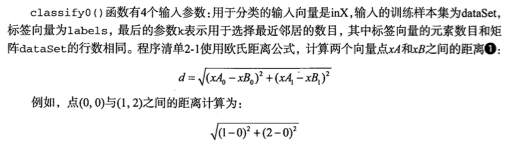
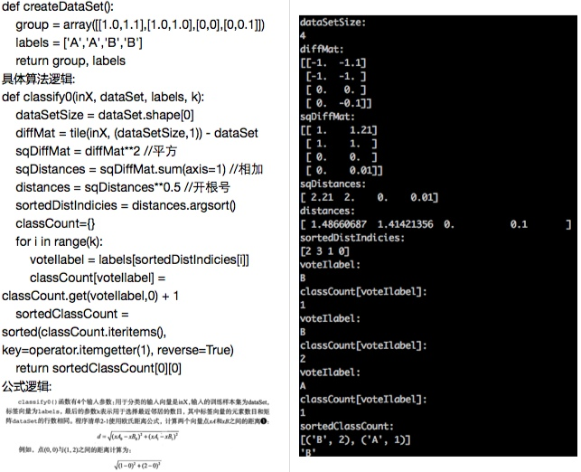

#K-means算法
采用测量不同特征值之间的距离算法进行分类
优点:精度高,对异常值不敏感,无数据输入假定
缺点:计算复杂度高,空间复杂度高
适用数据范围:数值型和标称型

##K-近邻算法的一般流程
* 收集数据:可以使用任何方法.
* 准备数据:距离计算需要的数值,最好是结构化的数据格式
* 分析数据:可以使用任何方法
* 训练算法:不适用于k近邻算法
* 测试算法:计算错误率
* 使用算法:首先需要输入样本数据和结构化输出结果,然后运行K-近邻算法判定输入数据分别属于哪个分类,最后应用对计算出的分类执行后续处理

算法细节:对未知类别属性的数据集中的每个点依次执行操作:
a. 计算已知类别点与当前点之间的距离
b. 按照距离依次递增排序
c. 选取与当前点距离最小的k个点
d. 确定前k个点所在类别的出现频率
e. 返回前k个点出现频率最高的类别作为当前点的预测分类


###下面将展示两个实践过程:
* 方案a是需要将简单实例跑一遍
* 方案b是需要进行垂直扩展,把数据量扩大
* 方案c是需要进行自动化处理过程

###方案A完整的实践过程:
以简单的电影分类作为一个案例,其中包含了电影名称,打斗镜头,接吻镜头,电影类型

#####一:使用Python导入数据

数据格式如下:

电影 | 打斗镜头 | 接吻镜头 | 电影类型
------------ | ------------- | ------------ | ------------
Califorma Man | 10  | 30 | 爱情片
泰坦尼克 | 20  | 40 | 动作片
泰坦尼克2 | 20  | 40 | 未知

python代码如下:

```
def createDataSet():
    group = array([[1.0,1.1],[1.0,1.0],[0,0],[0,0.1]])
    labels = ['A','A','B','B']
    return group, labels
```

#####二:从文本中解析数据

算法原理:


参数设置:

* intX: [1.0,2.0]  需要验证的数据
* dataSet:[[3.2],[4,5],[2,6]]  数据集合
* labels: ['A','B','C'] 数据标签
* k:3  前N个数字

```
#inX：用于分类的输入向量。即将对其进行分类。
#dataSet：训练样本集
#labels:标签向量
def classfy0(inX,dataSet,labels,k):
    #距离计算
    dataSetSize =dataSet.shape[0]#得到数组的行数。即知道有几个训练数据
    diffMat     =tile(inX,(dataSetSize,1))-dataSet#tile:numpy中的函数。tile将原来的一个数组，扩充成了4个一样的数组。diffMat得到了目标与训练数值之间的差值。
    sqDiffMat   =diffMat**2#各个元素分别平方
    sqDistances =sqDiffMat.sum(axis=1)#对应列相乘，即得到了每一个距离的平方
    distances   =sqDistances**0.5#开方，得到距离。
    sortedDistIndicies=distances.argsort()#升序排列
    #选择距离最小的k个点。
    classCount={}
    for i in range(k): ##获取到前K个点
        voteIlabel=labels[sortedDistIndicies[i]]  ##获取到标签
        classCount[voteIlabel]=classCount.get(voteIlabel,0)+1  #相同标签值累加
    #排序
    sortedClassCount=sorted(classCount.iteritems(),key=operator.itemgetter(1),reverse=True)
    return sortedClassCount[0][0] ##返回标签
```

算法说明:



>>>>测试脚本

classfy0([0,0],group,labels,3)

#####三:测试分类器
分类器给出的错误结果/测试执行数量


###真实案例:改善约会网站的配对效果:
对人群进行分类:不喜欢的人,魅力一般的人,极具魅力的人

#####算法的执行过程:
a. 收集数据:提供文本内容
b. 准备数据:使用python解析文件
c. 分析数据:使用Matlplot进行数据探索
d. 训练算法:此步暂时不适用
e. 测试步骤:根据对应的数据集合,选取90%的数据作为训练数据集,选取10%的作为结果数据集
f. 具体根据输入生成的算法:

#####一:从文本中解析数据
a. 创建以零填充的矩阵Numpy
b. 设置列的维度为3
c. 数据处理line.strip截取所有回车字符,同时进行元素分割
d. 利用负索引提取标签到最后一个列上面

```
def file2matrix(filename):
    fr = open(filename)
    numberOfLines = len(fr.readlines())         #get the number of lines in the file
    returnMat = zeros((numberOfLines,3))        #prepare matrix to return
    classLabelVector = []                       #prepare labels return   
    fr = open(filename)
    index = 0
    for line in fr.readlines():
        line = line.strip()
        listFromLine = line.split('\t')
        returnMat[index,:] = listFromLine[0:3]
        classLabelVector.append(int(listFromLine[-1]))
        index += 1
    return returnMat,classLabelVector
```

#####二:使用Matplotlib创建散点图
查看数据分布情况

```
from numpy import *
import matplotlib
import matplotlib.pyplot as plt

fig = plt.figure()
ax = fig.add_subplot(111)
datingDataMat,datingLabels = kNN.file2matrix('datingTestSet.txt')
#ax.scatter(datingDataMat[:,1], datingDataMat[:,2])
ax.scatter(datingDataMat[:,1], datingDataMat[:,2], 15.0*array(datingLabels), 15.0*array(datingLabels))
ax.axis([-2,25,-0.2,2.0])
plt.xlabel('Percentage of Time Spent Playing Video Games')
plt.ylabel('Liters of Ice Cream Consumed Per Week')
plt.show()
```

#####三:数据归一化
数据归一化 数值的量纲差异，导致通过差异平均进行运算的距离当中，某些指标会被认为认为所占权重进行扩大,确保每个指标都是同等重要的,将取值数据转换成0-1范围内
这里最巧妙的一点就是:特征值矩阵优3000乘以3，而rangeh只有1乘以3
因此，需要用tile()进行数据的复制，扩展到多个行里面，保证每个行都能够进行计算

```
def autoNorm(dataSet):
    minVals = dataSet.min(0)
    maxVals = dataSet.max(0)
    ranges = maxVals - minVals
    normDataSet = zeros(shape(dataSet))
    m = dataSet.shape[0]
    normDataSet = dataSet - tile(minVals, (m,1))
    normDataSet = normDataSet/tile(ranges, (m,1))   #element wise divide
    return normDataSet, ranges, minVals
```

#####四:测试算法
90%的数据用于训练样本作为训练集合，10%的数据用测试样本 

```
def datingClassTest():
    hoRatio = 0.50      #hold out 10%
    datingDataMat,datingLabels = file2matrix('datingTestSet2.txt')       #load data setfrom file
    normMat, ranges, minVals = autoNorm(datingDataMat)
    m = normMat.shape[0]
    numTestVecs = int(m*hoRatio)
    errorCount = 0.0
    for i in range(numTestVecs):
        classifierResult = classify0(normMat[i,:],normMat[numTestVecs:m,:],datingLabels[numTestVecs:m],3)
        print "the classifier came back with: %d, the real answer is: %d" % (classifierResult, datingLabels[i])
        if (classifierResult != datingLabels[i]): errorCount += 1.0
    print "the total error rate is: %f" % (errorCount/float(numTestVecs))
    print errorCount
```
这里比较巧妙的设计就是通过循环遍历前10%取出来的数据,生成总体标签


###真实案例:文本识别


#####单行读取文本
```
def img2vector(filename):
    returnVect = zeros((1,1024))
    fr = open(filename)
    for i in range(32):
        lineStr = fr.readline()
        for j in range(32):
            returnVect[0,32*i+j] = int(lineStr[j])
    return returnVect
```

#####读取文件进行自动化分类
```
def handwritingClassTest():
    hwLabels = []
    trainingFileList = listdir('trainingDigits')           #load the training set
    m = len(trainingFileList)
    trainingMat = zeros((m,1024))
    for i in range(m):
        fileNameStr = trainingFileList[i]
        fileStr = fileNameStr.split('.')[0]     #take off .txt
        classNumStr = int(fileStr.split('_')[0])
        hwLabels.append(classNumStr)
        trainingMat[i,:] = img2vector('trainingDigits/%s' % fileNameStr)
    testFileList = listdir('testDigits')        #iterate through the test set
    errorCount = 0.0
    mTest = len(testFileList)
    for i in range(mTest):
        fileNameStr = testFileList[i]
        fileStr = fileNameStr.split('.')[0]     #take off .txt
        classNumStr = int(fileStr.split('_')[0])
        vectorUnderTest = img2vector('testDigits/%s' % fileNameStr)
        classifierResult = classify0(vectorUnderTest, trainingMat, hwLabels, 3)
        print "the classifier came back with: %d, the real answer is: %d" % (classifierResult, classNumStr)
        if (classifierResult != classNumStr): errorCount += 1.0
    print "\nthe total number of errors is: %d" % errorCount
    print "\nthe total error rate is: %f" % (errorCount/float(mTest))
```

###总结：

* 算法总结

算法的优劣 |
------------ |
k近邻算法是基于实例的算法，使用算法的时候，必须要有接近实例的数据集，所以需要保存大量的数据集合，占用存储空间 2.需要计算每个样本之间的距离非常的消耗性能 |

* 算法提炼

算法的关键步骤 |
------------ |
1.获取数据生成向量(接口) 1.2:数据归一处理(标准) 2.分类算法(标准) 3.测试算法(标准) 4.自动化输入 |

* python标准调用实现

算法标准调用 |
------------ |
函数使用,需要注意的是原始数据并没有形成标准,这是根据具体情况,只要保证返回的是array数组就可以了|

0.原始数据获取,返回

numpy.array

1.分类:

```
#inX：用于分类的输入向量。即将对其进行分类。
#dataSet：训练样本集
#labels:标签向量
#k:取前N个数字
#return:数据标签
classify0(inX,dataSet,labels,k)
实际使用:
dataSet = array([[1.0,1.1],[1.0,1.0],[0,0],[0,0.1]])
labels = ['A','A','B','B']
classifierResult = KNN.classify0([1.0,2.0],dataSet,labels,3)
```

2.数据处理

```
#dataSet：样本数据集
norMat,ranges,minvals = KNN.autoNorm(dataSet)
print norMat
```


3.测试数据集(内部会进行数据归一处理)

```
#hoRatio：测试集合在总体数据集比例: 0~1
#dataSet：样本数据集
#labels:标签向量
#return:返回分类标签以及错误率
hoRatio = 0.4
datingDataMat = array([[1.0,1.1],[1.0,1.0],[2.0,3.0],[2.0,0.1],[1.0,1.1],[1.0,1.0],[2.0,3.0],[2.0,0.1]])
datingLabels = ['A','A','B','B','A','A','B','B']
KNN.ClassifyTest(hoRatio,datingDataMat,datingLabels)
```

####类包源代码:

```
from numpy import *
import operator
from os import listdir

def classify0(inX, dataSet, labels, k):
    dataSetSize = dataSet.shape[0]
    diffMat = tile(inX, (dataSetSize,1)) - dataSet
    sqDiffMat = diffMat**2
    sqDistances = sqDiffMat.sum(axis=1)
    distances = sqDistances**0.5
    sortedDistIndicies = distances.argsort()     
    classCount={}          
    for i in range(k):
        voteIlabel = labels[sortedDistIndicies[i]]
        classCount[voteIlabel] = classCount.get(voteIlabel,0) + 1
    sortedClassCount = sorted(classCount.iteritems(), key=operator.itemgetter(1), reverse=True)
    return sortedClassCount[0][0]

def createDataSet():
    group = array([[1.0,1.1],[1.0,1.0],[0,0],[0,0.1]])
    labels = ['A','A','B','B']
    return group, labels

def file2matrix(filename):
    fr = open(filename)
    numberOfLines = len(fr.readlines())         #get the number of lines in the file
    returnMat = zeros((numberOfLines,3))        #prepare matrix to return
    classLabelVector = []                       #prepare labels return   
    fr = open(filename)
    index = 0
    for line in fr.readlines():
        line = line.strip()
        listFromLine = line.split('\t')
        returnMat[index,:] = listFromLine[0:3]
        classLabelVector.append(int(listFromLine[-1]))
        index += 1
    return returnMat,classLabelVector
    
def autoNorm(dataSet):
    minVals = dataSet.min(0)
    maxVals = dataSet.max(0)
    ranges = maxVals - minVals
    normDataSet = zeros(shape(dataSet))
    m = dataSet.shape[0]
    normDataSet = dataSet - tile(minVals, (m,1))
    normDataSet = normDataSet/tile(ranges, (m,1))   #element wise divide
    return normDataSet, ranges, minVals

def datingClassTest():
    hoRatio = 0.50      #hold out 10%
    datingDataMat,datingLabels = file2matrix('./KNN/datingTestSet2.txt')       #load data setfrom file
    normMat, ranges, minVals = autoNorm(datingDataMat)
    m = normMat.shape[0]
    numTestVecs = int(m*hoRatio)
    errorCount = 0.0
    for i in range(numTestVecs):
        classifierResult = classify0(normMat[i,:],normMat[numTestVecs:m,:],datingLabels[numTestVecs:m],3)
        print "the classifier came back with: %d, the real answer is: %d" % (classifierResult, datingLabels[i])
        if (classifierResult != datingLabels[i]): errorCount += 1.0
    print "the total error rate is: %f" % (errorCount/float(numTestVecs))
    print errorCount
    
def img2vector(filename):
    returnVect = zeros((1,1024))
    fr = open(filename)
    for i in range(32):
        lineStr = fr.readline()
        for j in range(32):
            returnVect[0,32*i+j] = int(lineStr[j])
    return returnVect

def handwritingClassTest():
    hwLabels = []
    trainingFileList = listdir('trainingDigits')           #load the training set
    m = len(trainingFileList)
    trainingMat = zeros((m,1024))
    for i in range(m):
        fileNameStr = trainingFileList[i]
        fileStr = fileNameStr.split('.')[0]     #take off .txt
        classNumStr = int(fileStr.split('_')[0])
        hwLabels.append(classNumStr)
        trainingMat[i,:] = img2vector('trainingDigits/%s' % fileNameStr)
    testFileList = listdir('testDigits')        #iterate through the test set
    errorCount = 0.0
    mTest = len(testFileList)
    for i in range(mTest):
        fileNameStr = testFileList[i]
        fileStr = fileNameStr.split('.')[0]     #take off .txt
        classNumStr = int(fileStr.split('_')[0])
        vectorUnderTest = img2vector('testDigits/%s' % fileNameStr)
        classifierResult = classify0(vectorUnderTest, trainingMat, hwLabels, 3)
        print "the classifier came back with: %d, the real answer is: %d" % (classifierResult, classNumStr)
        if (classifierResult != classNumStr): errorCount += 1.0
    print "\nthe total number of errors is: %d" % errorCount
    print "\nthe total error rate is: %f" % (errorCount/float(mTest))

def ClassifyTest(hoRatio,datingDataMat,datingLabels):
    #hoRatio = 0.50      #hold out 10%
    #datingDataMat,datingLabels = file2matrix('./KNN/datingTestSet2.txt')       #load data setfrom file
    normMat, ranges, minVals = autoNorm(datingDataMat)
    m = normMat.shape[0]
    numTestVecs = int(m*hoRatio)
    errorCount = 0.0
    for i in range(numTestVecs):
        classifierResult = classify0(normMat[i,:],normMat[numTestVecs:m,:],datingLabels[numTestVecs:m],3)
        print "the classifier came back with: %s, the real answer is: %s" % (classifierResult, datingLabels[i])
        if (classifierResult != datingLabels[i]): errorCount += 1.0
    print "the total error rate is: %f" % (errorCount/float(numTestVecs))
    print errorCount
```


