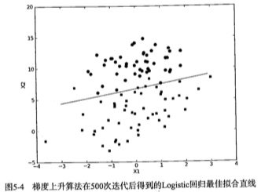
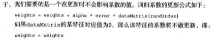

#Logistic回归
用一条直线对这些点进行拟合,这个拟合的过程就叫做回归，包含基本的梯度上升法，改进的随机梯度上升发
根据现有数据对分类边界线建立回归公式，以此进行分类

##回归的一般操作步骤
1. 收集数据:采用任意方法收集数据
2. 准备数据：需要进行举例计算，因此要求数据类型为数值型
3. 分析数据：采用任意方法对数据进行分析
4. 训练算法：大部分时间将用于训练，训练的目的是为了找到最佳的分类回归系数
5. 测试算法：一旦训练步骤完成，分类将会很快
6. 使用算法：输入一些数据，基于训练好的回归系数就可以对这些数值进行简单的回归计算，判定属于哪个类别

####基于Logistic回归和Sigmoid函数的分类
优点：代价不高，易于理解和实现
缺点：容易欠拟合，分类精度可能不高
分类回归：每个特征上都乘以一个回归系数，然后把所有结果值相加，带入Sigmoid函数，得到一个范围在0-1之间的数值，这里的Logistic回归也可以被看成是一种概率估计。大于0.5的数据被分入1类，小于0.5被归入0类
问题变成了最佳回归系数是多少？如何确定它们的大小。

####基于最优化方法的最佳回归系数确定
向量w获取到最佳参数

#####1.梯度上升法:
要找到某函数的最大值,最好的方法就是沿着该函数的梯度方向探寻.

重复R次:
	计算整个数据集的梯度
	使用alpha*gradient更新回归系数的向量
	返回回归系数

```
#获取到数据集
#dataMat：X0:默认为1,X1,X2
[[1.0, -0.017612, 14.053064],
 [1.0, -1.395634, 4.662541], 
 [1.0, -0.752157, 6.53862]]
#labelMat:数据的分类标签
[0, 1, 0,]
def loadDataSet():
    dataMat = []; labelMat = []
    fr = open('testSet.txt')
    for line in fr.readlines():
        lineArr = line.strip().split()
        dataMat.append([1.0, float(lineArr[0]), float(lineArr[1])])
        labelMat.append(int(lineArr[2]))
    return dataMat,labelMat
```

分类函数:

```
def sigmoid(inX):
    return 1.0/(1+exp(-inX))
```

回归梯度模型

```
#dataMatIn:上面的特征值矩阵
#classLabels:分类标签
#前两步是将数据转换成Numpy矩阵
#alpha:向目标移动的步长
#maxCycles:迭代次数
#使用for循环完成后,将返回训练好的回归系数
def gradAscent(dataMatIn, classLabels):
    dataMatrix = mat(dataMatIn)             #convert to NumPy matrix
    labelMat = mat(classLabels).transpose() #convert to NumPy matrix
    m,n = shape(dataMatrix)
    alpha = 0.001
    maxCycles = 500
    weights = ones((n,1))
    for k in range(maxCycles):              #heavy on matrix operations
        h = sigmoid(dataMatrix*weights)     #matrix mult
        error = (labelMat - h)              #vector subtraction
        weights = weights + alpha * dataMatrix.transpose()* error #matrix mult
    return weights
```

#####2.画出决策边界:

```
#这里的weghts是上面计算出来的最优参数
def plotBestFit(weights):
    import matplotlib.pyplot as plt
    dataMat,labelMat=loadDataSet()
    dataArr = array(dataMat)
    n = shape(dataArr)[0] 
    xcord1 = []; ycord1 = []
    xcord2 = []; ycord2 = []
    for i in range(n):
        if int(labelMat[i])== 1:
            xcord1.append(dataArr[i,1]); ycord1.append(dataArr[i,2])
        else:
            xcord2.append(dataArr[i,1]); ycord2.append(dataArr[i,2])
    fig = plt.figure()
    ax = fig.add_subplot(111)
    ax.scatter(xcord1, ycord1, s=30, c='red', marker='s')
    ax.scatter(xcord2, ycord2, s=30, c='green')
    x = arange(-3.0, 3.0, 0.1)
    y = (-weights[0]-weights[1]*x)/weights[2]
    ax.plot(x, y)
    plt.xlabel('X1'); plt.ylabel('X2');
    plt.show()
```



#####3.随机梯度上升:
如果样本达到了数十亿和上万的特征,那么计算复杂度太高了,一种改进方法是用一个样本点来更新回归系数


```
def stocGradAscent0(dataMatrix, classLabels):
    m,n = shape(dataMatrix)
    alpha = 0.01
    weights = ones(n)   #initialize to all ones
    for i in range(m):
        h = sigmoid(sum(dataMatrix[i]*weights))
        error = classLabels[i] - h
        weights = weights + alpha * error * dataMatrix[i]
    return weights
```

##案例:从病症预测病马的死亡率

#####1.使用logistic回归估计马的死亡率
* 收集数据:给定数据文件
* 准备数据:用Python解析文本并**填充缺失值**
* 分析数据:可视化并观察数据
* 训练算法:优化算法,找到最佳系数
* 测试算法:为了量化回归模型,观察错误率,通过改变迭代的次数和步长等参数得到更好的回归系数
* 使用算法:使用简单的命令行

#####2.准备数据:处理数据中的缺失值
* 使用可用特征均值来填补缺失值
* 使用特殊值来填补，例如-1
* 忽略有缺失值的样本
* 使用相似样本的均值填补缺失值
* 请用其他机器模型学习算法预测


如果对于文本缺失的数据,需要去除该条记录

#####3.测试算法:用Logistic回归进行分类

 ....待添加..


