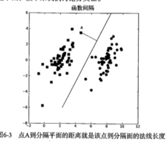
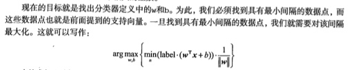

#SVM 支持向量机
最流行的实现方式:序列最小优化

##SVM算法基础
优点:泛化错误率低,计算开销不大,结果易解释
缺点:对参数调节和核函数的选择铭感,原始分类器不加修改仅适用于处理二类问题
适用数据类型:数值型,标称型数据

分类决策的超平面:支持向量就是离分隔超平面最近的那些点.数据点在二维平面上,那就是一条直线,如果数据点在三维或者多维上面,那么就是超平面.

####寻找最大间隔
分割超平面的形式可以写成wx+b,计算点A到分割超平面的距离,就是点到垂线的距离,类似截距



####分类器的优化求解
通过分类优化函数对 f(wx+b) 截距进行处理,就可以得到标签
找到最小间隔的数据点,一旦找到最小间隔的数据点,就对间隔进行最大化



####SVM应用的一般框架
* 收集数据:可以使用任意方法
* 准备数据:需要数值型数据
* 分析数据:有助于可视化分隔超平面
* 训练算法:SVM的大部分时间源自训练 **该过程主要实现两个参数的调优**
* 测试算法:十分简单的计算过程实现
* 使用算法:SVM本身是一种二类分类器

####SMO高效优化算法

SMO算法把大优化问题分解为多个小优化问题来求解，分解为多个小优化问题来求解。
求出一系列alpha和b，计算出权重向量w，并得到分隔超平面
通过引入所谓的松弛变量,允许某些数据点处于分割面的错误一侧,一旦求解出所有的alpha,那么
分割超平面就可以通过alpha来表达.
**SVM的主要工作就是求解这些alpha**
**二次规划:线性约束下的具有多个变量的二次目标函数**

####SMO算法

注意：这里获取到的labelMat都是1,-1等等这些标签

```
def loadDataSet(fileName):
    dataMat = []; labelMat = []
    fr = open(fileName)
    for line in fr.readlines():
        lineArr = line.strip().split('\t')
        dataMat.append([float(lineArr[0]), float(lineArr[1])])
        labelMat.append(float(lineArr[2]))
    return dataMat,labelMat
```

获取一个数字,在给定的范围不等于本身的随机数字:
```
#i:表示输入数字  alpha的下标  m是所有的alpha的数目
#m:表示给予的数组范围
def selectJrand(i,m):
    j=i #we want to select any J not equal to i
    while (j==i):
        j = int(random.uniform(0,m))
    return j
```

本身用于调整大于H或小于L的alpha的值
```
def clipAlpha(aj,H,L):
    if aj > H: 
        aj = H
    if L > aj:
        aj = L
    return aj
```

简化版SMO算法
* alpha可以更改进入优化过程
* 随机选择第二个alpha
* 保证alpha在0和C之间
* 对i进行修改,修改量与j相同,但方向相反
* 设置常数项

b,alphas = svmMLiA.smoSimple(dataMat,labelMat,0.6,0.001,40)
采用Numpy库对数据进行矩阵化处理,同时构建alpha列矩阵,所有元素都初始化为0,并建立一个iter变量
当变量达到了maxIter时,函数运行结束.

alphaPairsChanged用于记录alpha是否已经进行优化
fXi能够计算变量类别，基于这个实例对应的alpha进行优化,可以计算EI,如果误差很大,则需要进行进一步的优化
```
dataMatIn:数据集
classLabels:类别标签
C: 常数C
toler:容错率
maxIter:取消前的最大循环次数
def smoSimple(dataMatIn, classLabels, C, toler, maxIter):
#dataMatrix矩阵化  labelMat标签矩阵转置  构建alphas矩阵 iter循环次数
    dataMatrix = mat(dataMatIn); labelMat = mat(classLabels).transpose()
    b = 0; m,n = shape(dataMatrix)
    alphas = mat(zeros((m,1)))
    iter = 0
    while (iter < maxIter):
        alphaPairsChanged = 0
        for i in range(m):
            fXi = float(multiply(alphas,labelMat).T*(dataMatrix*dataMatrix[i,:].T)) + b
            Ei = fXi - float(labelMat[i])#if checks if an example violates KKT conditions
            if ((labelMat[i]*Ei < -toler) and (alphas[i] < C)) or ((labelMat[i]*Ei > toler) and (alphas[i] > 0)):
                j = selectJrand(i,m)
                fXj = float(multiply(alphas,labelMat).T*(dataMatrix*dataMatrix[j,:].T)) + b
                Ej = fXj - float(labelMat[j])
                alphaIold = alphas[i].copy(); alphaJold = alphas[j].copy();
                if (labelMat[i] != labelMat[j]):
                    L = max(0, alphas[j] - alphas[i])
                    H = min(C, C + alphas[j] - alphas[i])
                else:
                    L = max(0, alphas[j] + alphas[i] - C)
                    H = min(C, alphas[j] + alphas[i])
                if L==H: print "L==H"; continue
                eta = 2.0 * dataMatrix[i,:]*dataMatrix[j,:].T - dataMatrix[i,:]*dataMatrix[i,:].T - dataMatrix[j,:]*dataMatrix[j,:].T
                if eta >= 0: print "eta>=0"; continue
                alphas[j] -= labelMat[j]*(Ei - Ej)/eta
                alphas[j] = clipAlpha(alphas[j],H,L)
                if (abs(alphas[j] - alphaJold) < 0.00001): print "j not moving enough"; continue
                alphas[i] += labelMat[j]*labelMat[i]*(alphaJold - alphas[j])#update i by the same amount as j
                                                                        #the update is in the oppostie direction
                b1 = b - Ei- labelMat[i]*(alphas[i]-alphaIold)*dataMatrix[i,:]*dataMatrix[i,:].T - labelMat[j]*(alphas[j]-alphaJold)*dataMatrix[i,:]*dataMatrix[j,:].T
                b2 = b - Ej- labelMat[i]*(alphas[i]-alphaIold)*dataMatrix[i,:]*dataMatrix[j,:].T - labelMat[j]*(alphas[j]-alphaJold)*dataMatrix[j,:]*dataMatrix[j,:].T
                if (0 < alphas[i]) and (C > alphas[i]): b = b1
                elif (0 < alphas[j]) and (C > alphas[j]): b = b2
                else: b = (b1 + b2)/2.0
                alphaPairsChanged += 1
                print "iter: %d i:%d, pairs changed %d" % (iter,i,alphaPairsChanged)
        if (alphaPairsChanged == 0): iter += 1
        else: iter = 0
        print "iteration number: %d" % iter
    return b,alphas
```

完整版SMO算法
采用通过最大化步长的方式,同时建立一个全局的缓存用于保存误差值,获取到Ei-Ej最大的alpha值

其中首先初始化基本信息:

```

class optStructK:
    def __init__(self,dataMatIn, classLabels, C, toler):  # Initialize the structure with the parameters 
        self.X = dataMatIn
        self.labelMat = classLabels
        self.C = C
        self.tol = toler
        self.m = shape(dataMatIn)[0]
        self.alphas = mat(zeros((self.m,1)))
        self.b = 0
        self.eCache = mat(zeros((self.m,2))) #first column is valid flag
        
def calcEkK(oS, k):
    fXk = float(multiply(oS.alphas,oS.labelMat).T*(oS.X*oS.X[k,:].T)) + oS.b
    Ek = fXk - float(oS.labelMat[k])
    return Ek
        
def selectJK(i, oS, Ei):         #this is the second choice -heurstic, and calcs Ej
    maxK = -1; maxDeltaE = 0; Ej = 0
    oS.eCache[i] = [1,Ei]  #set valid #choose the alpha that gives the maximum delta E
    validEcacheList = nonzero(oS.eCache[:,0].A)[0]
    if (len(validEcacheList)) > 1:
        for k in validEcacheList:   #loop through valid Ecache values and find the one that maximizes delta E
            if k == i: continue #don't calc for i, waste of time
            Ek = calcEk(oS, k)
            deltaE = abs(Ei - Ek)
            if (deltaE > maxDeltaE):
                maxK = k; maxDeltaE = deltaE; Ej = Ek
        return maxK, Ej
    else:   #in this case (first time around) we don't have any valid eCache values
        j = selectJrand(i, oS.m)
        Ej = calcEk(oS, j)
    return j, Ej
    
```


---我觉得这章我估计很难看懂了。。。。。。
先往下看吧。。。。。


