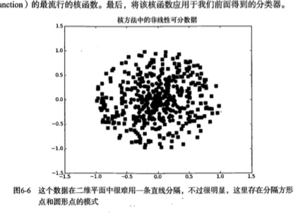
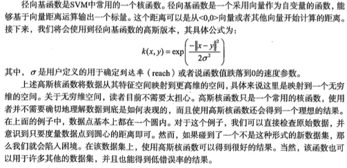
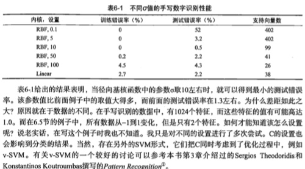

#SVM 支持向量机
最流行的实现方式:序列最小优化

##SVM算法基础
优点:泛化错误率低,计算开销不大,结果易解释
缺点:对参数调节和核函数的选择铭感,原始分类器不加修改仅适用于处理二类问题
适用数据类型:数值型,标称型数据

分类决策的超平面:支持向量就是离分隔超平面最近的那些点.数据点在二维平面上,那就是一条直线,如果数据点在三维或者多维上面,那么就是超平面.

####寻找最大间隔
分割超平面的形式可以写成wx+b,计算点A到分割超平面的距离,就是点到垂线的距离,类似截距


####分类器的优化求解
通过分类优化函数对 f(wx+b) 截距进行处理,就可以得到标签
找到最小间隔的数据点,一旦找到最小间隔的数据点,就对间隔进行最大化


####SVM应用的一般框架
* 收集数据:可以使用任意方法
* 准备数据:需要数值型数据
* 分析数据:有助于可视化分隔超平面
* 训练算法:SVM的大部分时间源自训练 **该过程主要实现两个参数的调优**
* 测试算法:十分简单的计算过程实现
* 使用算法:SVM本身是一种二类分类器

####SMO高效优化算法

SMO算法把大优化问题分解为多个小优化问题来求解，分解为多个小优化问题来求解。
**求出一系列alpha和b，计算出权重向量w，并得到分隔超平面**
通过引入所谓的松弛变量,允许某些数据点处于分割面的错误一侧,一旦求解出所有的alpha,那么
分割超平面就可以通过alpha来表达.
**SVM的主要工作就是求解这些alpha**
**二次规划:线性约束下的具有多个变量的二次目标函数**

####SMO算法
* 每次循环中选择两个alpha进行优化处理.
* 一旦找到一对合适的alpha,那么增大其中一个同时减小另外一个
* 简化版:在数据集上遍历每一个alpha,然后在剩下的集合中随机选择另外一个alpha


注意：这里获取到的labelMat都是1,-1等等这些标签

```
def loadDataSet(fileName):
    dataMat = []; labelMat = []
    fr = open(fileName)
    for line in fr.readlines():
        lineArr = line.strip().split('\t')
        dataMat.append([float(lineArr[0]), float(lineArr[1])])
        labelMat.append(float(lineArr[2]))
    return dataMat,labelMat
```

获取一个数字,在给定的范围不等于本身的随机数字:

```
#i:表示输入数字  alpha的下标  m是所有的alpha的数目
#m:表示给予的数组范围
def selectJrand(i,m):
    j=i #we want to select any J not equal to i
    while (j==i):
        j = int(random.uniform(0,m))
    return j
```

本身用于调整大于H或小于L的alpha的值

```
def clipAlpha(aj,H,L):
    if aj > H: 
        aj = H
    if L > aj:
        aj = L
    return aj
```

####简化版SMO算法
* alpha可以更改进入优化过程
* 随机选择第二个alpha
* 保证alpha在0和C之间
* 对i进行修改,修改量与j相同,但方向相反
* 设置常数项

b,alphas = svmMLiA.smoSimple(dataMat,labelMat,0.6,0.001,40)
采用Numpy库对数据进行矩阵化处理,同时构建alpha列矩阵,所有元素都初始化为0,并建立一个iter变量
当变量达到了maxIter时,函数运行结束.

alphaPairsChanged用于记录alpha是否已经进行优化
fXi能够计算变量类别，基于这个实例对应的alpha进行优化,可以计算EI,如果误差很大,则需要进行进一步的优化

```
#alphas:核心在于优化每个特征的权重,从左往右依次优化数据权重
dataMatIn:数据集
classLabels:类别标签
C: 常数C
toler:容错率
maxIter:取消前的最大循环次数

output:
alphas 返回最终算法分类的结果
b

def smoSimple(dataMatIn, classLabels, C, toler, maxIter):
#dataMatrix矩阵化  labelMat标签矩阵转置  构建alphas矩阵 iter循环次数
    dataMatrix = mat(dataMatIn); labelMat = mat(classLabels).transpose()
    b = 0; m,n = shape(dataMatrix)
    alphas = mat(zeros((m,1)))
    iter = 0
    #构建循环
    while (iter < maxIter):
        alphaPairsChanged = 0
        for i in range(m):
        **fXI是计算得出的预测类别**
            fXi = float(multiply(alphas,labelMat).T*(dataMatrix*dataMatrix[i,:].T)) + b
        **Ei是预测类别和真实类别之间的对比,获取对比差异**
            Ei = fXi - float(labelMat[i])#if checks if an example violates KKT conditions
            if ((labelMat[i]*Ei < -toler) and (alphas[i] < C)) or ((labelMat[i]*Ei > toler) and (alphas[i] > 0)):
                j = selectJrand(i,m)
                fXj = float(multiply(alphas,labelMat).T*(dataMatrix*dataMatrix[j,:].T)) + b
                Ej = fXj - float(labelMat[j])
                alphaIold = alphas[i].copy(); alphaJold = alphas[j].copy();
                if (labelMat[i] != labelMat[j]):
                    L = max(0, alphas[j] - alphas[i])
                    H = min(C, C + alphas[j] - alphas[i])
                else:
                    L = max(0, alphas[j] + alphas[i] - C)
                    H = min(C, alphas[j] + alphas[i])
                if L==H: print "L==H"; continue
                eta = 2.0 * dataMatrix[i,:]*dataMatrix[j,:].T - dataMatrix[i,:]*dataMatrix[i,:].T - dataMatrix[j,:]*dataMatrix[j,:].T
                if eta >= 0: print "eta>=0"; continue
                alphas[j] -= labelMat[j]*(Ei - Ej)/eta
                alphas[j] = clipAlpha(alphas[j],H,L)
                if (abs(alphas[j] - alphaJold) < 0.00001): print "j not moving enough"; continue
                alphas[i] += labelMat[j]*labelMat[i]*(alphaJold - alphas[j])#update i by the same amount as j
                                                                        #the update is in the oppostie direction
                b1 = b - Ei- labelMat[i]*(alphas[i]-alphaIold)*dataMatrix[i,:]*dataMatrix[i,:].T - labelMat[j]*(alphas[j]-alphaJold)*dataMatrix[i,:]*dataMatrix[j,:].T
                b2 = b - Ej- labelMat[i]*(alphas[i]-alphaIold)*dataMatrix[i,:]*dataMatrix[j,:].T - labelMat[j]*(alphas[j]-alphaJold)*dataMatrix[j,:]*dataMatrix[j,:].T
                if (0 < alphas[i]) and (C > alphas[i]): b = b1
                elif (0 < alphas[j]) and (C > alphas[j]): b = b2
                else: b = (b1 + b2)/2.0
                alphaPairsChanged += 1
                print "iter: %d i:%d, pairs changed %d" % (iter,i,alphaPairsChanged)
        if (alphaPairsChanged == 0): iter += 1
        else: iter = 0
        print "iteration number: %d" % iter
    return b,alphas
```

```
调用过程
b,alphas = svmMLiA.smoSimple(dataMat,labelMat,0.6,0.001,40)
print alphas[alphas > 0]
```


####完整版SMO算法

采用通过最大化步长的方式,同时建立一个全局的缓存用于保存误差值,获取到Ei-Ej最大的alpha值

其中首先初始化基本信息:

```

class optStructK:
#建立数据结构保存所有的重要值#
    def __init__(self,dataMatIn, classLabels, C, toler):  # Initialize the structure with the parameters 
        self.X = dataMatIn
        self.labelMat = classLabels
        self.C = C
        self.tol = toler
        self.m = shape(dataMatIn)[0]
        self.alphas = mat(zeros((self.m,1)))
        self.b = 0
        self.eCache = mat(zeros((self.m,2))) #first column is valid flag
#由于在算法中经常用到,计算E值并返回,需要单独拿出来#        
def calcEkK(oS, k):
    fXk = float(multiply(oS.alphas,oS.labelMat).T*(oS.X*oS.X[k,:].T)) + oS.b
    Ek = fXk - float(oS.labelMat[k])
    return Ek
        
def selectJK(i, oS, Ei):         #this is the second choice -heurstic, and calcs Ej
    maxK = -1; maxDeltaE = 0; Ej = 0
    oS.eCache[i] = [1,Ei]  #set valid #choose the alpha that gives the maximum delta E
    validEcacheList = nonzero(oS.eCache[:,0].A)[0]
    if (len(validEcacheList)) > 1:
        for k in validEcacheList:   #loop through valid Ecache values and find the one that maximizes delta E
            if k == i: continue #don't calc for i, waste of time
            Ek = calcEk(oS, k)
            deltaE = abs(Ei - Ek)
            if (deltaE > maxDeltaE):
                maxK = k; maxDeltaE = deltaE; Ej = Ek
        return maxK, Ej
    else:   #in this case (first time around) we don't have any valid eCache values
        j = selectJrand(i, oS.m)
        Ej = calcEk(oS, j)
    return j, E
```

####更新数据缓存

```
def updateEkK(oS, k):#after any alpha has changed update the new value in the cache
    Ek = calcEk(oS, k)
    oS.eCache[k] = [1,Ek]
```

####寻求决策优化边界的优化例程
外部完成的Platt SMO算法

```
def innerLK(i, oS):
    Ei = calcEk(oS, i)
    if ((oS.labelMat[i]*Ei < -oS.tol) and (oS.alphas[i] < oS.C)) or ((oS.labelMat[i]*Ei > oS.tol) and (oS.alphas[i] > 0)):
        j,Ej = selectJ(i, oS, Ei) #this has been changed from selectJrand
        alphaIold = oS.alphas[i].copy(); alphaJold = oS.alphas[j].copy();
        if (oS.labelMat[i] != oS.labelMat[j]):
            L = max(0, oS.alphas[j] - oS.alphas[i])
            H = min(oS.C, oS.C + oS.alphas[j] - oS.alphas[i])
        else:
            L = max(0, oS.alphas[j] + oS.alphas[i] - oS.C)
            H = min(oS.C, oS.alphas[j] + oS.alphas[i])
        if L==H: print "L==H"; return 0
        eta = 2.0 * oS.X[i,:]*oS.X[j,:].T - oS.X[i,:]*oS.X[i,:].T - oS.X[j,:]*oS.X[j,:].T
        if eta >= 0: print "eta>=0"; return 0
        oS.alphas[j] -= oS.labelMat[j]*(Ei - Ej)/eta
        oS.alphas[j] = clipAlpha(oS.alphas[j],H,L)
        #更新误差#
        updateEk(oS, j) #added this for the Ecache
        if (abs(oS.alphas[j] - alphaJold) < 0.00001): print "j not moving enough"; return 0
        oS.alphas[i] += oS.labelMat[j]*oS.labelMat[i]*(alphaJold - oS.alphas[j])#update i by the same amount as j
        updateEk(oS, i) #added this for the Ecache                    #the update is in the oppostie direction
        b1 = oS.b - Ei- oS.labelMat[i]*(oS.alphas[i]-alphaIold)*oS.X[i,:]*oS.X[i,:].T - oS.labelMat[j]*(oS.alphas[j]-alphaJold)*oS.X[i,:]*oS.X[j,:].T
        b2 = oS.b - Ej- oS.labelMat[i]*(oS.alphas[i]-alphaIold)*oS.X[i,:]*oS.X[j,:].T - oS.labelMat[j]*(oS.alphas[j]-alphaJold)*oS.X[j,:]*oS.X[j,:].T
        if (0 < oS.alphas[i]) and (oS.C > oS.alphas[i]): oS.b = b1
        elif (0 < oS.alphas[j]) and (oS.C > oS.alphas[j]): oS.b = b2
        else: oS.b = (b1 + b2)/2.0
        return 1
    else: return 0
```

####完整的外循环smoPK调用
```
def smoPK(dataMatIn, classLabels, C, toler, maxIter):    #full Platt SMO
    oS = optStruct(mat(dataMatIn),mat(classLabels).transpose(),C,toler)
    iter = 0
    entireSet = True; alphaPairsChanged = 0
    while (iter < maxIter) and ((alphaPairsChanged > 0) or (entireSet)):
        alphaPairsChanged = 0
        if entireSet:   #go over all
            for i in range(oS.m):        
                alphaPairsChanged += innerL(i,oS)
                print "fullSet, iter: %d i:%d, pairs changed %d" % (iter,i,alphaPairsChanged)
            iter += 1
        else:#go over non-bound (railed) alphas
            nonBoundIs = nonzero((oS.alphas.A > 0) * (oS.alphas.A < C))[0]
            for i in nonBoundIs:
                alphaPairsChanged += innerL(i,oS)
                print "non-bound, iter: %d i:%d, pairs changed %d" % (iter,i,alphaPairsChanged)
            iter += 1
        if entireSet: entireSet = False #toggle entire set loop
        elif (alphaPairsChanged == 0): entireSet = True  
        print "iteration number: %d" % iter
    return oS.b,oS.alphas
```

```
#调用实例
dataArr,labelArr = svmMLiA.loadDataSet('testSet.txt')
b,alphas = svmMLiA.smoP(dataArr,labelArr,0.6,0.001,40)
```

####花了大量时间计算alpha的值,那么就可以基于alpha进行分类,首先得到超平面

```
def calcWs(alphas,dataArr,classLabels):
    X = mat(dataArr); labelMat = mat(classLabels).transpose()
    m,n = shape(X)
    w = zeros((n,1))
    for i in range(m):
        w += multiply(alphas[i]*labelMat[i],X[i,:].T)
    return w
#获取标签值
ws = svmMLiA.calcWs(alphas,dataArr,labelArr)
tag = dataMat[0]*mat(ws)+b
```
如果该值大于0,那么其属于1类,如果该值小于0,那么则属于-1类。

####在复杂数据上应用核函数
当所有的数据都集中在一个圆里面的时候,需要采用复杂的形式进行数据分割.

核函数(kernel)将数据转换成易于分类器理解的形式,包含了径向基函数
从一特征空间映射到另外一个特征空间


#####径向基核函数


kernelTrans:核转换函数
```
def kernelTrans(X, A, kTup): #calc the kernel or transform data to a higher dimensional space
    m,n = shape(X)
    K = mat(zeros((m,1)))
    if kTup[0]=='lin': K = X * A.T   #linear kernel
    elif kTup[0]=='rbf':
        for j in range(m):
            deltaRow = X[j,:] - A
            K[j] = deltaRow*deltaRow.T
        K = exp(K/(-1*kTup[1]**2)        ) #divide in NumPy is element-wise not matrix like Matlab
    else: raise NameError('Houston We Have a Problem -- \
    That Kernel is not recognized')
    return K
```

optStruct引入新的变量kTup,是一个包含核函数信息的元祖

#####测试中使用核函数
构建有效的分类器:1用户定义的输入 2.利用该核函数构建一个分类器testRbf


```
#获取数据
#运行smoP算法,其中核函数的类型为rbf
#最重要的是for循环那两行,给出了如何利用核函数进行分类
#kernelTrans使用核函数
def testRbf(k1=1.3):
    dataArr,labelArr = loadDataSet('testSetRBF.txt')
    b,alphas = smoP(dataArr, labelArr, 200, 0.0001, 10000, ('rbf', k1)) #C=200 important
    datMat=mat(dataArr); labelMat = mat(labelArr).transpose()
    svInd=nonzero(alphas.A>0)[0]
    sVs=datMat[svInd] #get matrix of only support vectors
    labelSV = labelMat[svInd];
    print "there are %d Support Vectors" % shape(sVs)[0]
    m,n = shape(datMat)
    errorCount = 0
    for i in range(m):
        kernelEval = kernelTrans(sVs,datMat[i,:],('rbf', k1))
        predict=kernelEval.T * multiply(labelSV,alphas[svInd]) + b
        if sign(predict)!=sign(labelArr[i]): errorCount += 1
    print "the training error rate is: %f" % (float(errorCount)/m)
    dataArr,labelArr = loadDataSet('testSetRBF2.txt')
    errorCount = 0
    datMat=mat(dataArr); labelMat = mat(labelArr).transpose()
    m,n = shape(datMat)
    for i in range(m):
        kernelEval = kernelTrans(sVs,datMat[i,:],('rbf', k1))
        predict=kernelEval.T * multiply(labelSV,alphas[svInd]) + b
        if sign(predict)!=sign(labelArr[i]): errorCount += 1    
    print "the test error rate is: %f" % (float(errorCount)/m) 
```

##案例:手写识别问题
对于KNN来说,效果不错,但是需要保留所有的训练样本
对于SVM来说,只需要保留支持向量就可以了,好像是一个不错的选择


#####基于SVM的数字识别
收集数据:提供的文本文件
准备数据:基于二值图像构造向量
分析数据:对图像向量进行目测
训练算法:采用两种不同的核函数,采用不同的设置进行SMO算法
测试算法:编写一个函数来测试不同的核函数并计算错误率
使用算法:一个图像识别的完整应用还需要一些图像处理的知识, 

```
##获取到测试数据
def loadImages(dirName):
    from os import listdir
    hwLabels = []
    trainingFileList = listdir(dirName)           #load the training set
    m = len(trainingFileList)
    trainingMat = zeros((m,1024))
    for i in range(m):
        fileNameStr = trainingFileList[i]
        fileStr = fileNameStr.split('.')[0]     #take off .txt
        classNumStr = int(fileStr.split('_')[0])
        if classNumStr == 9: hwLabels.append(-1)
        else: hwLabels.append(1)
        trainingMat[i,:] = img2vector('%s/%s' % (dirName, fileNameStr))
    return trainingMat, hwLabels
```

```
核心工程代码: 和之前的大同小异
#1.loadImages修改
def testDigits(kTup=('rbf', 10)):
    dataArr,labelArr = loadImages('trainingDigits')
    b,alphas = smoP(dataArr, labelArr, 200, 0.0001, 10000, kTup)
    datMat=mat(dataArr); labelMat = mat(labelArr).transpose()
    svInd=nonzero(alphas.A>0)[0]
    sVs=datMat[svInd] 
    labelSV = labelMat[svInd];
    print "there are %d Support Vectors" % shape(sVs)[0]
    m,n = shape(datMat)
    errorCount = 0
    for i in range(m):
        kernelEval = kernelTrans(sVs,datMat[i,:],kTup)
        predict=kernelEval.T * multiply(labelSV,alphas[svInd]) + b
        if sign(predict)!=sign(labelArr[i]): errorCount += 1
    print "the training error rate is: %f" % (float(errorCount)/m)
    dataArr,labelArr = loadImages('testDigits')
    errorCount = 0
    datMat=mat(dataArr); labelMat = mat(labelArr).transpose()
    m,n = shape(datMat)
    for i in range(m):
        kernelEval = kernelTrans(sVs,datMat[i,:],kTup)
        predict=kernelEval.T * multiply(labelSV,alphas[svInd]) + b
        if sign(predict)!=sign(labelArr[i]): errorCount += 1    
    print "the test error rate is: %f" % (float(errorCount)/m) 
#2.testDigits修改 直接进行错误测试
svmMLiA.testDigits(('rbf',20))
```



