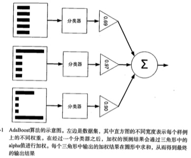

#利用AdaBoost元算法提高分类性能
当做重要决定时,大家会吸取多个专家而不是一个人的意见,元算法:对其他算法进行组合.AdaBoost是最好的监督学习的方法,这是目前最好的监督学习的方法,讨论不同分类器的集成方法:关注boosting方法及代表分类器adaboost.建立单层决策树(decision stump)分类器
还会面临到一个非均衡分类问题。


##基于数据集多重抽样的分类器
AdaBoost
* 优点:泛化错误率低,易编码,可以应用在大部分分类器,无参数调整.
* 缺点:对离群点敏感
* 数据类型:数值型和标称型数据


####bagging:基于数据随机重抽样的分类器构建方法
* 自举汇聚法:从原始数据集选择S次后得到S个新数据集的一种技术
* 通过在原始数据集中随机选择样本来获得,在S个数据集建好之后,
* 将某个学习算法分别作用域每个数据集就得到了S个分类器
* 选择分类器投票结果中**最多的类别作为最后的分类结果**

比较先进的有：随机深林

####bagging:基于数据随机重抽样的分类器构建方法
其中前者,不同分类器是通过串行训练获得的.boosting是通过集中关注被已有分类器错分的哪些数据获得新的分类
是基于所有分类器的加权求和结果的,因此,boosting与bagging不太一样,每个权重会不太一样,
ababoost


####AdaBoost的一般流程:
* 收集数据:可以使用任意方法
* 准备数据:依赖所使用的弱分类器,目前使用的是单层决策树,也可以使用SVM,KNN,贝叶斯,logistc中的任意一种
* 分析数据:可以使用任意方法
* 训练算法:多次在同一数据集训练弱分类器
* 使用算法:同SVM一样,预测两个类别中的一个,如果需要应该用到多个类别,则需要修改


#####原理:调整的权重反复计算



#####基于单层决策树构建弱分类器
单层决策树只有一个分裂过程

加载数据:

```
def loadSimpData():
    datMat = matrix([[ 1. ,  2.1],
        [ 2. ,  1.1],
        [ 1.3,  1. ],
        [ 1. ,  1. ],
        [ 2. ,  1. ]])
    classLabels = [1.0, 1.0, -1.0, -1.0, 1.0]
    return datMat,classLabels
    
##plot
from numpy import *
import matplotlib
import matplotlib.pyplot as plt
from matplotlib.patches import Circle

xcord0 = []
ycord0 = []
xcord1 = []
ycord1 = []
markers =[]
colors =[]
fr = open('testSet.txt')#this file was generated by 2normalGen.py
for line in fr.readlines():
    lineSplit = line.strip().split('\t')
    xPt = float(lineSplit[0])
    yPt = float(lineSplit[1])
    label = int(lineSplit[2])
    if (label == -1):
        xcord0.append(xPt)
        ycord0.append(yPt)
    else:
        xcord1.append(xPt)
        ycord1.append(yPt)

fr.close()
fig = plt.figure()
ax = fig.add_subplot(111)
ax.scatter(xcord0,ycord0, marker='s', s=90)
ax.scatter(xcord1,ycord1, marker='o', s=50, c='red')
plt.title('Support Vectors Circled')
circle = Circle((4.6581910000000004, 3.507396), 0.5, facecolor='none', edgecolor=(0,0.8,0.8), linewidth=3, alpha=0.5)
ax.add_patch(circle)
circle = Circle((3.4570959999999999, -0.082215999999999997), 0.5, facecolor='none', edgecolor=(0,0.8,0.8), linewidth=3, alpha=0.5)
ax.add_patch(circle)
circle = Circle((6.0805730000000002, 0.41888599999999998), 0.5, facecolor='none', edgecolor=(0,0.8,0.8), linewidth=3, alpha=0.5)
ax.add_patch(circle)
#plt.plot([2.3,8.5], [-6,6]) #seperating hyperplane
b = -3.75567; w0=0.8065; w1=-0.2761
x = arange(-2.0, 12.0, 0.1)
y = (-w0*x - b)/w1
ax.plot(x,y)
ax.axis([-2,12,-8,6])
plt.show()
```

a. 第一个函数:用于测试是否有某个值小于或者大于我们正在测试的阀值
stumpClassify通过阀值比较对数据分类,阀值一边的数据分到-1,另外一边的数据分到+1
b. 第二个函数:它会在一个加权数据集中循环,并找到具有最低错误率的单层决策树


